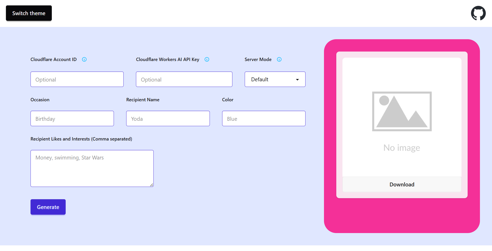

# Card Generator
https://card-generator.yoda-flash.hackclub.app/

A project that allows users to generate cards for people, for all sorts of occasions.



By inputting the relevant information in each of the information fields, 
a prompt will be formatted. 
Through the Cloudflare Workers AI API, 
the Flux 1 (Schnell) model by the Black Forest Labs will generate a card based on the prompt.
The resulting card will be displayed on the right, and can be downloaded.

## General Use

### API Key Information
It is not necessary to have your own Cloudflare Account ID and Workers AI API Key to use this site.
However, there is a limit of 10k Neurons per day (roughly 100 images) for my account, and this limit is spread across all users of this site.
Therefore, if you use your own account, you may use this site to generate many more images before you reach the limit,
and you will not have to share your quota with others. 

For more information on using your own API Keys, refer to the [Advanced Use](#advanced-use) section

### Server Mode
For general use, it is recommended to use the Default mode, so you do not have to download the code and host your own server.

### Occasion
Enter the occasion for the card. For example, this can be "birthday", "Father's Day", "anniversary", etc. 

### Recipient Name
Enter the name (or names) of the intended card recipient. 

### Color
Enter a color (or multiple), which the card will be based in.

### Recipient Likes and Interests
Enter comma-separated words representing things that the recipient likes, which will provide more context for the card generation.
These items may be included in the card, resulting in a more personalized result for the recipient.

## Additional Functions
### Switch Theme
Click on the "Switch Theme" button to cycle through different themes until you find one that you like!

### GitHub Icon
Click on the GitHub Icon to navigate to this GitHub Repository and look at source code or usage instructions.

## Advanced Use
### Local Hosting
If you use your own API keys and are concerned about backend security, you may host your own server locally. 
Please note that you must use your own API keys if you do so.
You may host locally by following the steps below.

1. Clone this GitHub repository 
    - Run ```git clone https://github.com/Yoda-Flash/card-generator.git``` in your desired directory through the terminal
    - Navigate to the cloned repository's directory with ```cd card-generator/```
2. Install all required dependencies with ```npm install```
3. Run an Express.js Server by running ```node server.js``` within the repository directory
    - If ```Server running``` shows up in the terminal, then it means the server is up and running
    - You may navigate to http://localhost:37244 to view the server page
    - To stop the server, press Ctrl+C in the terminal to end the node command
4. Select the "Localhost" mode in the "Server Mode" selection list on the web page

### Using your own API Keys
To get your own Cloudflare Workers AI API Keys, follow the steps below.
1. Create a Cloudflare account [here](https://dash.cloudflare.com/sign-up/workers-and-pages)
2. Once an account has been created, follow the resulting instructions to get your Workers AI API Key. 

Input your Cloudflare Account ID and your Cloudflare Workers AI API Key into their respective input boxes on the web page to use them to generate cards.

### Using API keys stored with dotenv
For additional security, it is possible to use dotenv to store your API keys. 
This way, you do not need to input your API keys into the web page.
You may do so by following the steps below (which assume a local server has been set up).

1. Create a file named ```.env``` in the repository directory
2. Add ```ACCOUNT_ID={your Cloudflare Account ID}``` into the ```.env``` file
3. Add ```API_KEY={your Cloudflare Workers AI API Key}``` into the ```.env``` file

*Hosting your own local server is a prerequisite for this. 
For instructions, please refer to the [Local Hosting](#local-hosting) section.

## CLI Mode
You may also use this program as a CLI, instead of using the web page to generate cards.
This allows for more customizability.
However, it requires more setup, as you must [use dotenv to store your own API keys](#using-api-keys-stored-with-dotenv) and [host a server locally](#local-hosting).

### By Argument
One option of using the CLI is through inputting your card prompt as an argument when you run the file.
To do so, run ```node cli.js -p "{your prompt}"``` from the repository directory.

### By Input
Another option of using the CLI is by running the file first, 
and then inputting your card prompt by typing it in after the "Insert prompt: " prompt.
To do so, run ```node cli.js``` from the repository directory.

